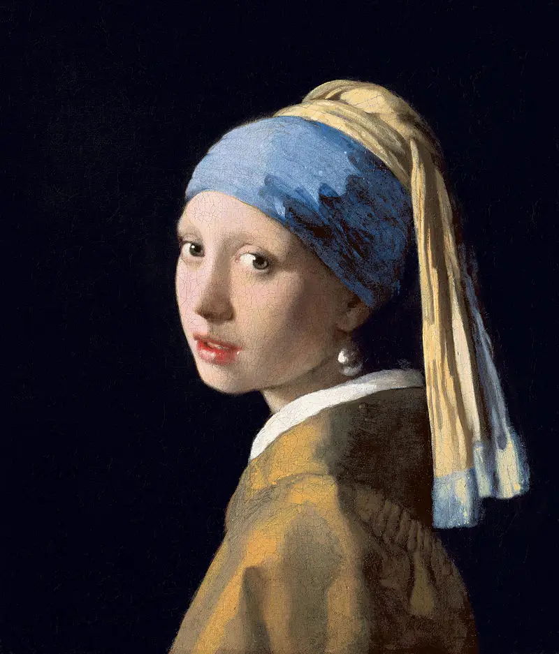
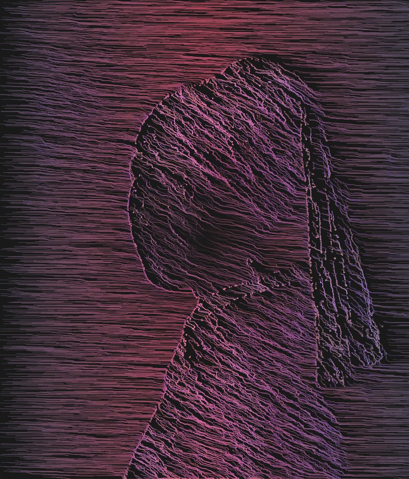

# Flow-Edge-Detection

## Description
A graphics project to simulate lines flowing and forming user input images with simple per-pixel edge detection. This Project uses p5.js to generate the output image inside a html canvas. You **do not** need to add p5 to this poject, all the necessary p5 files are inside "libraries/";

## Here's how it works
### Choose your image
After cloning the repository, simply save any ".jpg" image you want inside "assets/" as "image.jpg". The example found by default in this repository is the famous painting: "Meisje met de parel";
##### Note:
_Note that the edge detection in this project uses variance in color, this means that images with solid one colored backgrounds work better then colorful images_;

### Run it!
Then, simply execute the index.html file found in the root directory of this repository. You can also run a live server on VSCode if you want hot reloads while editing the project;
##### Result
After Runing the default image, here's the result:

### Save it
You can also save the result locally by clicking "Save" and choosing the path.
